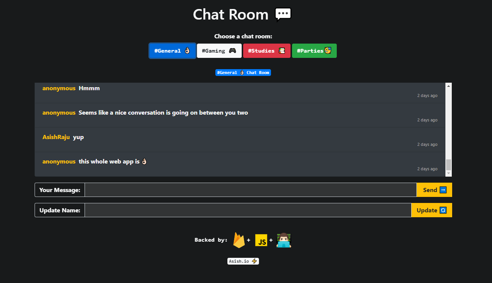

# ChatRoom 💬
 A Firebase backed chat app with diffrent chatroom functionality

 ## Check it out [here]!
 

## Overview 👀

- ChatRoom is single page webapp where its user can choose diffrent chatroom for chatting
- This project uses firebase's firestore as a backend service for storing and retreving chats all in real time
- User can update his name during his session time

## WIP 🛠
- Number of user online
- Number of user online(per chatroom)
- Custom user chatroom
- Notification for new chat message
- Authentication using firebaseAuth
- Mobile APP

## How To Contribute🤝 
- Yes,it is open source you can clone and change code to your need.
- Most of the code is self explanatory, anyhow
- for any clarification on code or want to contribute contact 
- [Gmail] / [Twitter] /[LinkedIn]

[Gmail]: <mailto:vashish888@gmail.com>
[LinkedIn]: <https://www.linkedin.com/in/asish-raju-7a0b90192>
[Twitter]: <https://twitter.com/vashish888>
[here]:<https://asishraju.github.io/ChatRoom/>

